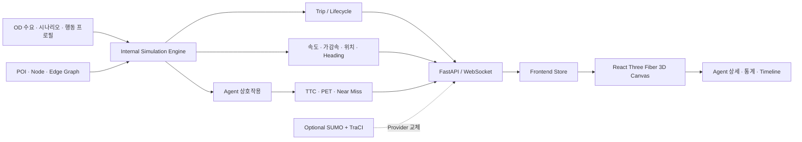
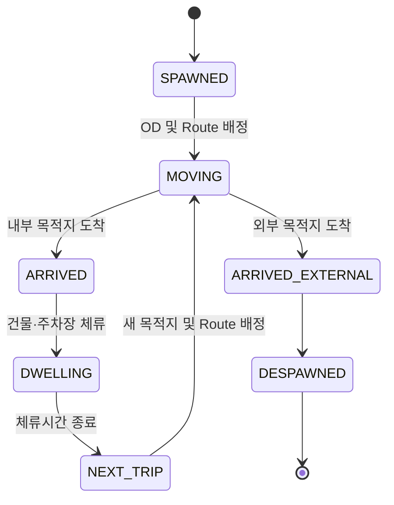
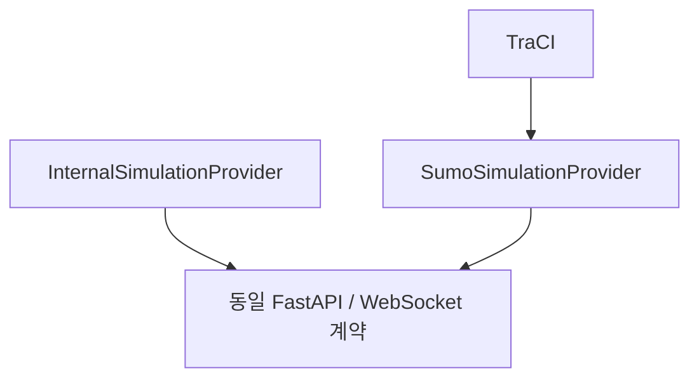

# 캠퍼스 교통 시뮬레이션 팀 브리핑

작성일: 2026-08-12  
대상: 개발팀, 연구팀, 발표 담당자  
목적: 시뮬레이션에 적용된 이론과 현재 코드가 실제로 동작하는 방식을 같은 언어로 설명한다.

---

## 1. 한 문장으로 설명하면

이 시스템은 자동차·보행자·전동 킥보드를 각각 독립된 Agent로 관리하고, 각 Agent가 출발지와 목적지를 선택한 뒤 허용된 Graph 경로를 따라 이동하며, 매 시뮬레이션 Step마다 주변 Agent와의 상호작용 및 TTC·PET 기반 위험을 계산해 React Three Fiber 3D 화면으로 전송하는 **OD 기반 미시적 교통 시뮬레이션**이다.

현재 기본 실행 엔진은 자체 Python 엔진인 `InternalSimulationProvider`다. SUMO Provider도 분리되어 있지만, 현재 개발 장비에는 SUMO/TraCI와 승인된 실제 교통망이 없으므로 자동으로 내부 엔진을 사용한다.

---

## 2. 전체 구조



Three.js는 교통 물리 계산을 담당하지 않는다. Python 백엔드가 Agent 상태를 계산하고, 프런트엔드는 전달받은 위치와 방향을 부드럽게 보간해 표시한다.

---

## 3. 적용한 이론적 배경

### 3.1 미시적 교통 시뮬레이션

미시적 시뮬레이션은 “차량 30대”처럼 전체 수치만 계산하지 않고 다음과 같이 객체 하나하나를 독립적으로 관리한다.

```text
car_001
person_037
scooter_014
```

각 Agent는 다음 상태를 갖는다.

- 현재 위치와 이전 위치
- 속도, 가속도, 진행 방향
- 출발지와 목적지
- 현재 Trip과 Route
- 현재 Edge와 Segment
- 이동·도착·체류 상태
- 행동 프로필
- 위험 등급과 상호작용 상태
- 이동 거리, 대기시간, 급제동, Near Miss 등의 개별 통계

이 구조 덕분에 전체 개체 수뿐 아니라 `scooter_014`가 어디서 어디로 가며 어떤 위험을 경험했는지 추적할 수 있다.

### 3.2 Origin–Destination 이동

OD는 Origin과 Destination의 약자다. Agent는 단순히 LineString 끝에서 방향을 바꾸지 않고 다음 Trip을 갖는다.

```text
Origin → Graph Route → Destination → Dwell 또는 Despawn → Next Trip
```

OD 쌍은 시간대·시나리오·Agent 종류별 가중치로 선택된다. 모든 목적지를 같은 확률로 고르지 않는다.

예:

- 오전: 외부 → 건물 수요 증가
- 점심: 건물 → 학생회관 또는 건물 → 건물 증가
- 하교: 건물 → 외부, 건물 → 주차장 증가

### 3.3 Graph와 최단 경로

캠퍼스 이동망은 다음 요소로 해석한다.

- Node: 교차점, Gate, POI 연결점
- Edge: 도로, 보행로, 횡단보도, 주차 연결로 등
- POI: 건물, 주차장, 외부 출입점, 킥보드 주차점

경로 탐색은 외부 라이브러리 없이 구현한 Dijkstra 최단 경로를 사용한다. Edge 길이를 비용으로 사용하며, Agent 종류가 해당 Edge의 `allowed_types`에 포함될 때만 탐색한다.

즉 보행자는 보행 가능한 Edge만, 자동차는 차량 통행 Edge만 경로 후보로 사용할 수 있다.

### 3.4 연속적인 위치와 속도

Agent 위치는 경로의 진행률을 단순히 0과 1 사이로 왕복시키지 않는다. 현재 이동 거리 `s`를 누적하고, 경로 Segment에서 다음과 같이 위치를 보간한다.

```text
position = segment_start + ratio × (segment_end - segment_start)
ratio = segment 내부 이동거리 / segment 길이
```

속도는 목표 속도로 즉시 바뀌지 않는다.

```text
v(t + Δt) = clamp(v(t) + a × Δt, 0, target_speed)
```

가속과 감속 한도는 행동 프로필에 따라 달라진다. Heading 역시 목표 각도로 즉시 회전하지 않고 짧은 시간에 걸쳐 보간된다.

### 3.5 상호작용 기반 속도 제약

각 Step에서 먼저 도로 속도제한, 곡선, 횡단보도, 날씨를 고려한 기본 목표 속도를 구한다. 그다음 주변 Agent 관계를 분석해 더 낮은 상호작용 목표 속도를 적용한다.

```text
최종 목표 속도 = min(기본 목표 속도, 상호작용 제약 속도)
```

상호작용 상태는 다음 우선순위를 갖는다.

```text
NONE < APPROACHING < FOLLOWING < CROSSING < AVOIDING < BRAKING < CONFLICT
```

### 3.6 대체 안전지표

실제 충돌은 드물기 때문에 교통안전 연구에서는 충돌 전 단계의 위험을 평가하는 대체 안전지표를 사용한다.

#### TTC: Time To Collision

선형 fallback에서는 현재 속도와 방향이 그대로 유지된다고 가정했을 때 두 객체의 형상 Envelope가 겹치기까지 남은 시간을 계산한다. 실제 Runtime은 Graph의 다음 Segment를 따라 0.25초 간격으로 6초 궤적을 먼저 예측하며, 곡선·회전이 있는 경우 이 Route 예측을 선형 TTC보다 우선한다.

상대 위치를 `p`, 상대 속도를 `v`, 충돌 반경을 `R`이라고 하면 다음 방정식의 가장 작은 0 이상의 해를 구한다.

```text
|p + v × t|² = R²
```

서로 멀어지는 경우, 상대 속도가 거의 없는 경우, 미래 Route 궤적의 객체 형상이 겹치지 않는 경우에는 TTC를 계산하지 않는다. 이때도 예상 최소 외곽 간격과 가장 가까워지는 시각은 별도로 기록한다.

#### Predicted Minimum Distance

예측 시간 범위 안에서 두 Agent가 가장 가까워지는 시점과 거리를 계산한다.

```text
t* = clamp(-(p · v) / |v|², 0, prediction_horizon)
d_min = |p + v × t*|
```

#### Predicted Path Intersection

두 Agent의 현재 진행 벡터가 미래에 교차하는지 계산하고, 두 Agent가 교차점에 도착하는 시간 차가 허용 범위 안인지 확인한다. 이것이 단순 거리만으로 위험을 판단하지 않는 이유다.

#### PET: Post-Encroachment Time

첫 번째 Agent가 Conflict Area를 빠져나간 시각과 두 번째 Agent가 같은 영역에 들어온 시각의 차이다.

```text
PET = 두 번째 Agent 진입시각 - 첫 번째 Agent 이탈시각
```

동시에 영역을 점유하면 PET는 0으로 기록한다. 현재 PET는 파생된 Conflict Area를 사용하므로 실제 연구 수치로 해석하려면 횡단보도와 교차부 실측 형상이 먼저 필요하다.

#### Required Deceleration

현재 접근 속도로 충돌 반경 전에 정지하려면 필요한 감속도를 계산한다.

```text
required_deceleration = closing_speed² / (2 × remaining_distance)
```

#### Time Headway

대표 속도 기준으로 현재 간격을 통과하는 데 필요한 시간이다.

```text
time_headway = distance / max(agent speeds)
```

---

## 4. 실제 코드가 한 Step에서 수행하는 일

기본 WebSocket 갱신 주기는 100ms다. 한 Step은 다음 순서로 실행된다.

```mermaid
sequenceDiagram
    participant Loop as Simulation Loop
    participant Engine as SimulationEngine
    participant OD as OD / Trip Manager
    participant IM as InteractionManager
    participant Risk as RiskEngine
    participant Stat as StatisticsManager
    participant WS as WebSocket
    participant UI as React Three Fiber

    Loop->>Engine: step(delta_time)
    Engine->>OD: 체류 종료 및 새 Trip 확인
    Engine->>Engine: 신호·날씨·곡선 기반 기본 속도
    Engine->>IM: Agent 쌍별 속도 제약 계산
    IM-->>Engine: BRAKING / AVOIDING / FOLLOWING
    Engine->>Engine: 가감속, 거리, 위치, Heading 갱신
    Engine->>Risk: TTC·최소거리·교차경로·PET 평가
    Risk-->>Stat: 위험 이벤트 및 안전 분류
    Stat->>Stat: Agent 통계·Trajectory·Timeline 기록
    Engine-->>WS: simulation_update snapshot
    WS-->>UI: entities, risks, statistics, signals
    UI->>UI: 위치·회전 보간 후 렌더링
```

세부 순서는 다음과 같다.

1. 실행 상태가 `running`인지 확인한다.
2. 시뮬레이션 시간을 증가시킨다.
3. 신호등 상태와 체류 중인 Agent를 갱신한다.
4. 각 Agent의 기본 목표 속도를 계산한다.
5. 15m 안쪽의 Agent 쌍을 대상으로 상호작용 제약을 계산한다.
6. 행동 프로필의 가속·감속 한도에 맞춰 실제 속도를 변경한다.
7. 이동거리를 누적하고 Graph 위 위치와 Heading을 계산한다.
8. 목적지에 도착하면 Trip을 완료하고 체류 또는 Despawn 처리한다.
9. Conflict Area 점유 변화를 갱신한다.
10. TTC·PET·최소거리·위험 등급을 계산한다.
11. Agent 통계와 최근 30초 Trajectory를 기록한다.
12. 최신 Snapshot을 WebSocket으로 프런트엔드에 보낸다.

---

## 5. Agent Lifecycle



- 내부 목적지 도착: Agent를 화면에서 숨기고 `DWELLING` 상태로 둔다.
- 체류 종료: 현재 목적지를 새 Origin으로 사용해 다음 Destination을 고른다.
- 외부 목적지 도착: `DESPAWNED` 처리하고 수요 프로필에 따라 새 Agent를 생성한다.
- 같은 짧은 경로를 즉시 역주행하는 Ping-Pong 로직은 사용하지 않는다.

---

## 6. 객체별 실제 이동 규칙

### 자동차

- 차량 허용 Edge만 Dijkstra 탐색에 사용한다.
- 경로 속도제한과 행동 프로필의 희망 속도 중 낮은 값을 사용한다.
- 큰 방향 전환이 가까워지면 교차로 진입 전에 감속한다.
- 같은 방향의 앞 차량이 9m 이내이고 횡방향 간격이 2.5m 미만이면 앞 차량 속도에 맞춘다.
- 횡단보도 보행자 또는 예측 교차경로가 있으면 거리 비례로 감속한다.
- 접근하는 킥보드가 있으면 감속하고, 가까울수록 목표 속도를 낮춘다.
- 외부 → Gate → 주차장, 주차장 → Gate → 외부 OD 흐름을 지원한다.

### 보행자

- 보행 허용 Edge, 횡단보도, 건물 입구 연결 경로를 사용한다.
- `WALKING`, `WAITING_CROSSWALK`, `CROSSING`, `JAYWALKING`, `ENTERING_BUILDING`, `LEAVING_BUILDING`, `DWELLING` 상태를 갖는다.
- 적색 신호 횡단보도에서는 무단횡단 Agent가 아니면 정지한다.
- 다른 보행자와 1.2m보다 가까우면 한 Agent가 잠시 양보해 완전히 겹치는 현상을 줄인다.
- 건물 도착 후 설정된 시간 동안 화면에서 사라졌다가 다음 Trip을 시작한다.

### 전동 킥보드

- Scooter Lane, Bike Lane, Shared Path, 조건부 도로, 횡단보도, 킥보드 주차 연결 정책을 지원한다.
- 자동차와 예상 진행경로가 교차하면 감속·회피한다.
- 보행자와 접근하거나 3m보다 가까우면 거리 비례로 감속한다.
- 우천과 강풍에서 목표 속도를 추가로 낮춘다.
- 시나리오에 따라 과속 또는 역주행 속성을 가진 일부 Agent를 생성할 수 있다.

---

## 7. 상호작용 예시

### 자동차–보행자

```text
보행자가 횡단보도 진입
→ 자동차와의 거리·상대속도·진행방향 계산
→ 접근 중이거나 예상 경로가 교차하면 자동차 목표 속도 감소
→ 자동차 상태 BRAKING
→ 위험 기준을 넘으면 TTC 이벤트 기록
→ 실제 양보가 발생하면 VEHICLE_YIELDING 분류 가능
```

### 자동차–킥보드

```text
두 Agent의 속도 벡터가 교차
→ 각 Agent의 교차점 도착 예상시간 계산
→ 시간 차가 허용 범위 이내면 CROSSING
→ 자동차 감속, 킥보드 AVOIDING
→ TTC·예측 최소거리·필요 감속도 계산
→ warning/danger이면 Risk Event 생성
```

### 킥보드–보행자

```text
거리 감소 또는 접근 상태 감지
→ 킥보드 목표 속도 감소
→ AVOIDING 또는 CONFLICT
→ 최소거리와 TTC가 Near Miss 조건을 만족하면 기록
```

### 자동차–자동차

```text
같은 진행방향 + 앞뒤 관계 + 작은 횡방향 차이
→ FOLLOWING 판정
→ 후행 차량 속도를 선행 차량 속도와 간격에 맞춰 제한
→ 필요한 경우 BRAKING
```

---

## 8. 현재 위험 판단 기준

다음 값은 `risk_config.json`에서 수정할 수 있는 **프로젝트 로컬 공학 가정값**이다. 특정 논문의 수치를 그대로 사용했다고 주장하지 않는다.

| 항목 | 현재 값 |
|---|---:|
| 주의 거리 | 5.0m |
| 경고 거리 | 3.0m |
| 위험 거리 | 1.5m |
| 주의 TTC | 5.0초 |
| 경고 TTC | 3.0초 |
| 위험 TTC | 1.5초 |
| Near Miss 최소거리 | 1.25m 이하 |
| Near Miss TTC | 1.5초 이하 |
| 기존 원형 fallback 반경 | 0.75m |
| 차량 형상 | 4.5m × 1.8m OBB |
| 보행자 형상 | 반경 0.35m Circle |
| 킥보드 형상 | 1.8m × 0.65m Capsule/OBB 근사 |
| 예측 시간 범위 | 6초 |
| 경로 교차 도착시간 허용 차이 | 2초 |
| 급제동 기준 | -3.5m/s² 미만 |
| 동일 Agent 쌍 이벤트 재기록 제한 | 8초 |

단순히 가까이 있다는 이유만으로 위험 이벤트를 만들지는 않는다. 접근 여부, TTC, 예상 경로 교차, 충돌 반경을 함께 고려한다.

안전 이벤트 종류:

- `COLLISION`
- `NEAR_MISS`
- `TRAFFIC_CONFLICT`
- `UNSAFE_CROSSING`
- `SUDDEN_BRAKING`
- `VEHICLE_YIELDING`
- `SCOOTER_YIELDING`

---

## 9. 행동 프로필과 시나리오

### 행동 프로필

- 자동차: cautious, normal, aggressive
- 보행자: student, staff, visitor, group, distracted
- 킥보드: safe, normal, aggressive

프로필에 따라 희망 속도, 최대 가속도, 편안한 감속도, 최소 간격, 양보 성향, 무단횡단·역주행 가능성이 달라진다.

### 시나리오

- normal
- morning_rush / rush_hour
- class_change
- lunch_time
- leaving_campus
- rain / rainy_day
- night
- high_pedestrian_density
- high_scooter_density
- vehicle_congestion
- scooter_speeding
- scooter_wrong_way
- jaywalking
- crosswalk_conflict
- emergency_vehicle

시나리오는 Agent 수, OD 시간대, 속도 배율, 날씨 및 위반 확률을 변경한다.

---

## 10. 프런트엔드에서 보이는 과정

1. `useSimulationSocket`이 `ws://127.0.0.1:8002/ws/simulation`에 연결한다.
2. 백엔드가 `simulation_update` Snapshot을 전송한다.
3. Store가 Agent·위험 이벤트·통계·신호·Timeline을 저장한다.
4. `TrafficSimulationLayer`가 기존 캠퍼스 Canvas 위에 이동 객체만 추가한다.
5. `TrafficEntity`가 `useFrame`에서 위치를 `lerp`하고 Heading을 감쇠 보간한다.
6. Agent를 클릭하면 상세 API를 호출해 OD, 속도, 상태, 안전지표, 통계와 최근 궤적을 표시한다.
7. 최근 궤적은 0.5초 간격, 최대 약 30초 분량으로 저장되어 3D Line으로 표시된다.

색상뿐 아니라 형태도 구분한다.

- 자동차: 차체 형태
- 보행자: 사람 형태와 보행 애니메이션
- 킥보드: 데크·핸들·바퀴 형태

---

## 11. API와 WebSocket

### 제어 API

| 기능 | 요청 |
|---|---|
| 상태 | `GET /api/simulation/status` |
| 시작 | `POST /api/simulation/start` |
| 일시정지 | `POST /api/simulation/pause` |
| 재개 | `POST /api/simulation/resume` |
| 초기화 | `POST /api/simulation/reset` |
| 속도 변경 | `POST /api/simulation/speed` |
| 시나리오 변경 | `POST /api/simulation/scenario` |

### 조회 API

| 기능 | 요청 |
|---|---|
| Agent 목록 | `GET /api/simulation/entities` |
| Agent 상세·궤적 | `GET /api/simulation/agents/{agent_id}` |
| 위험 이벤트 | `GET /api/simulation/events` |
| 이벤트 상세·Replay | `GET /api/simulation/events/{event_id}` |
| 통계 | `GET /api/simulation/statistics` |
| Timeline | `GET /api/simulation/timeline` |
| 교통망 | `GET /api/simulation/network` |
| 교통망 품질 | `GET /api/simulation/network/quality` |

### 실시간 데이터

```text
WS /ws/simulation
```

Snapshot의 핵심 필드:

```json
{
  "type": "simulation_update",
  "simulation_time": 12.4,
  "status": "running",
  "entities": [],
  "risk_events": [],
  "statistics": {},
  "traffic_lights": []
}
```

---

## 12. 개별 Agent 평가

공통 또는 객체별로 다음 항목을 누적한다.

| 범주 | 주요 지표 |
|---|---|
| 이동 | Trip 거리, 이동시간, 평균속도, 대기시간, 정지 횟수 |
| 차량 | 제동 횟수, 급제동, 선행차량 상호작용 |
| 보행자 | 보행시간, 횡단보도 대기시간, 무단횡단, 차량·킥보드 Conflict |
| 킥보드 | 과속시간, 역주행 거리, 차량·보행자 Conflict, 급제동 |
| 안전 | Conflict 수, Near Miss 수, 위험 노출시간, 최소 TTC/PET, 최대 Risk Score |

Timeline에는 `TRIP_START`, `TRIP_END`, `HARD_BRAKE`, Near Miss 및 Conflict 이벤트가 기록된다.

---

## 13. 현재 교통망의 정확한 상태

이 부분은 발표에서 반드시 사실대로 설명해야 한다.

| 항목 | 현재 상태 |
|---|---:|
| Node | 106개 |
| Edge | 364개 |
| POI | 14개 |
| 파생 Edge | 364개 |
| 승인된 실제 Edge | 0개 |
| Crosswalk 연결 Edge | 47개 |
| 메타데이터 Crosswalk ID | 24개 |
| 파생 매핑된 Crosswalk ID | 14개 |
| 실측 Crosswalk Polygon | 0개 |

### Runtime Network

`campus_transport_network.geojson`이 편집·검증·Runtime·SUMO 변환의 통합 Source of Truth다. 백엔드 시작 시 검증한 뒤 메모리에서 Mobility Graph로 변환한다.

- 기본 `transport-derived`: 파생 Edge를 허용하는 개발·시연 모드
- `research`: `authoritative=true` Edge만 허용하며, 현재는 승인 Edge가 0개라 명시적으로 실행을 거부
- `legacy`: 문제 진단용 이전 `mobility_graph.json` fallback

현재 364개 Edge는 모두 `derived=true`, `authoritative=false`다. 보행자는 파생 Shared Path에서 2.8m, 킥보드는 Shared Path에서 1.4m의 Runtime Offset을 사용하고, 교차로나 출입구에서는 Offset이 0으로 수렴한다. 이는 겹침을 줄이는 개발용 분리이며 실측 인도를 생성한 것이 아니다.

시간대 OD에 모든 허용 POI를 섞는 Coverage 수요와 Edge 사용량 기반 경로 비용을 적용해 같은 최단경로에 집중되는 현상을 줄인다. UI는 Agent별 실주행·계획 Edge Coverage를 표시한다.

따라서 현재 화면에서 자동차·보행자·킥보드가 서로 다른 정책으로 움직이는 것은 맞지만, 모든 구간이 실제 캠퍼스의 차도·인도·킥보드도로를 정밀하게 반영했다고 말할 수는 없다.

---

## 14. 횡단보도 구현 상태

논리 구현:

- Crosswalk Edge 판별
- 보행자 `CROSSING`·`WAITING_CROSSWALK` 상태
- 차량·킥보드 감속과 양보
- 적색 신호 보행자 대기
- 자동차–보행자 TTC 평가
- Conflict Area 기반 PET 계산

데이터 한계:

- 47개는 실제 횡단보도 개수가 아니라 Graph 연결 Edge 수다.
- 실제 메타데이터 Crosswalk ID 24개 중 14개만 파생 매핑되어 있다.
- 현장 측량 또는 CAD에서 확인된 횡단보도 Polygon은 아직 없다.
- 현재 14개 Conflict Area도 연구용 확정 형상이 아니라 파생 영역이다.

즉 **횡단보도 상호작용 로직은 구현되어 있지만 실제 위치와 폭은 아직 검증되지 않았다.**

---

## 15. SUMO 연동 상태



현재 상태:

- Provider 인터페이스 분리 완료
- SUMO 차량·사람·킥보드 Entity 변환 구조 구현
- TraCI Step 및 좌표 변환 구현
- SUMO 입력파일 생성 도구 구현
- 실행 전 Binary, Config, `.net.xml`, TraCI 확인 구현
- 현재 Mac에는 SUMO/TraCI가 없고 승인 Edge가 0개이므로 `ready=false`
- 가짜 `campus.net.xml`은 만들지 않으며 내부 Provider로 폴백

향후 승인된 교통망과 SUMO가 준비돼도 프런트엔드는 같은 Entity 계약을 사용하므로 큰 변경 없이 Provider를 교체할 수 있다.

---

## 16. 논문과 구현의 관계

이 프로젝트는 다음 연구의 **개념을 참고**했다.

- 차량–전동 킥보드 상호작용: 접근, 추종, 교차, 제동 반응
- SUMO 미시 시뮬레이션: 개별 Entity와 Route 중심 관리, Provider 교체 구조
- 차량–킥보드 위험분석: 거리 외에 상대속도, 접근 여부, TTC, 예상경로 교차 사용
- 보행자 안전평가: Collision 외에 Near Miss, Conflict, Unsafe Crossing, Yielding 기록
- CityFlow: 개별 Agent 통계, 궤적, Agent 단위 평가

주의할 점:

- 현재 Threshold와 행동 파라미터는 논문에서 복제한 값이 아니다.
- 프로젝트 로컬 초기 가정이며 실제 관측자료로 Calibration해야 한다.
- 연구 근거와 코드 대응은 `RESEARCH_TO_IMPLEMENTATION.md`에 별도로 정리돼 있다.

---

## 17. 팀 데모 권장 순서

### 1단계: 시스템 연결 확인

```bash
curl http://127.0.0.1:8002/health
```

예상 결과:

```json
{
  "status": "ok",
  "provider": "InternalSimulationProvider"
}
```

### 2단계: 기본 시뮬레이션

1. 브라우저에서 `http://127.0.0.1:5173` 접속
2. 상단의 `안전` 메뉴 선택
3. 자동차 30, 보행자 100, 킥보드 30 확인
4. `시작` 클릭
5. 객체가 경로를 따라 이동하고 시간이 증가하는지 확인

### 3단계: OD와 개별 Agent

1. 3D 객체 하나를 클릭
2. From/To, Route, 속도, 이동 상태 확인
3. TTC/PET, Conflict, Near Miss, 급제동 지표 확인
4. 최근 Trajectory Line 확인

### 4단계: 상호작용

1. `횡단보도 상충` 또는 `킥보드 과속` 시나리오 선택
2. 위험 이벤트 목록에서 Agent 쌍과 TTC 확인
3. Timeline에서 Conflict와 급제동 확인

### 5단계: 데이터 품질

1. Route Editing Mode 켜기
2. 기존 Network 표시
3. Data Quality에서 Derived 364, Authoritative 0 확인
4. 차도·보행로·킥보드 경로를 실측 데이터로 교체해야 한다는 점 설명

---

## 18. 발표 시 사용할 대표 설명

> 이전 구조처럼 짧은 경로의 끝에서 바로 방향을 뒤집는 방식이 아니라, 각 객체가 출발지와 목적지를 가진 Trip으로 이동합니다. 목적지에 도착하면 건물에 체류하거나 캠퍼스 밖으로 나가 제거되며, 이후 시간대별 수요에 따라 새 Trip 또는 새 Agent가 생성됩니다.

> 자동차·보행자·킥보드는 단순 애니메이션이 아니라 백엔드에서 개별 속도와 상태를 가진 Agent입니다. 매 Step마다 주변 객체의 상대 위치와 속도를 계산하고, 예상 경로가 교차하면 차량 감속이나 킥보드 회피가 실제 다음 위치 계산에 반영됩니다.

> 안전성은 단순 거리만 보지 않습니다. 접근 여부, 상대속도, TTC, 예측 최소거리, 경로 교차, PET, 급제동을 함께 기록합니다. 다만 현재 기준값은 연구 결과를 그대로 복제한 것이 아니라 Calibration 전의 프로젝트 가정값입니다.

> 현재 가장 큰 남은 과제는 알고리즘보다 실제 교통망 데이터입니다. 상호작용 로직은 작동하지만 차도·인도·횡단보도 형상이 아직 실측 승인되지 않았으므로, 현재 결과를 실제 캠퍼스 안전수준으로 해석해서는 안 됩니다.

---

## 19. 예상 질문과 답변

### Q. 현재 자동차와 보행자가 다른 길을 다니나?

코드상 `allowed_types`로 경로를 구분한다. 하지만 현재 보행·킥보드 경로의 상당 부분이 기존 차량 중심선에서 파생되어 실제 화면에서는 겹쳐 보일 수 있다. 실측 인도·킥보드 경로를 입력해야 물리적으로도 완전히 분리된다.

### Q. 횡단보도는 구현됐나?

상태, 감속, 양보, TTC, Conflict Area와 PET 로직은 구현됐다. 그러나 실제 횡단보도 Polygon은 아직 없고 현재 영역은 파생 데이터다.

### Q. 객체가 아직 왕복하는 것처럼 보일 수 있나?

OD 조합상 나중에 이전 장소로 돌아가는 새 Trip이 선택될 수는 있다. 하지만 같은 Route의 진행률을 뒤집는 Ping-Pong은 아니다. 도착, 체류, 새 목적지 선정이라는 별도의 Lifecycle을 거친다.

### Q. TTC가 낮으면 무조건 사고인가?

아니다. TTC는 현재 운동이 유지될 때의 잠재 충돌시간이다. Agent가 감속하거나 회피하면 실제 충돌은 발생하지 않을 수 있다. 그래서 TTC는 대체 안전지표로 해석한다.

### Q. 결과를 논문 수치로 바로 사용해도 되나?

아니다. 실제 교통망, 횡단보도 형상, OD 수요, 속도분포, 행동 파라미터를 관측자료로 보정하고 현장 검증을 수행한 뒤 사용해야 한다.

### Q. SUMO를 사용 중인가?

현재는 아니다. 현재 Runtime은 내부 Provider다. SUMO Provider 구조는 준비돼 있지만 설치된 SUMO/TraCI와 승인 교통망이 없어 안전하게 폴백한다.

---

## 20. 주요 구현 파일

| 역할 | 파일 |
|---|---|
| 전체 Step과 Agent 이동 | `backend/simulation/simulation_engine.py` |
| Trip·도착·체류·다음 Trip | `backend/simulation/trip_manager.py` |
| 시간대별 OD 선택 | `backend/simulation/od_manager.py` |
| Dijkstra와 경로 보간 | `backend/simulation/mobility_graph.py` |
| 객체 간 감속·회피 | `backend/simulation/interaction_manager.py` |
| TTC·위험등급·Near Miss | `backend/simulation/risk_engine.py` |
| Conflict Area와 PET | `backend/simulation/conflict_area.py` |
| Agent 통계·Trajectory·Replay | `backend/simulation/statistics_manager.py` |
| 행동 프로필 | `backend/simulation/config/behavior_profiles.json` |
| 위험 기준값 | `backend/simulation/data/risk_config.json` |
| OD 수요 | `backend/simulation/data/od_demand.json` |
| API·WebSocket | `backend/simulation/main.py` |
| Provider 선택 | `backend/simulation/traci_adapter.py` |
| SUMO Provider | `backend/simulation/providers/sumo_provider.py` |
| 3D Agent Layer | `frontend/src/simulation/components/TrafficSimulationLayer.jsx` |
| 객체 위치·회전 보간 | `frontend/src/simulation/components/TrafficEntity.jsx` |
| 안전 패널 | `frontend/src/simulation/components/TrafficSafetyPanel.jsx` |
| 통합 교통망 | `backend/simulation/data/campus_transport_network.geojson` |
| 교통망 검증 결과 | `backend/simulation/data/network_validation.json` |

---

## 21. 현재 검증 결과

- Python 테스트: 44개 통과
- Frontend Node 테스트: 140개 통과
- Vitest: 55개 통과
- Legacy 프런트엔드 빌드: 통과
- VWorld 프런트엔드 빌드: 통과
- 교통망 구조 검사: 오류 0, 경고 8
- Agent 타입별 파생 Graph 연결성: 100%
- 브라우저 검증: WebSocket 연결, 30/100/30 Agent, 시나리오, Timeline, 편집 패널, 시뮬레이션 시간 증가 확인

경고 8개는 좌표가 겹치는 POI Node 6건과 독립 보행 연결이 부족한 파생 횡단보도 Edge 2건이다.

---

## 22. 다음 단계

1. CAD/GIS 또는 GLB 검토로 실제 차도 중심선·인도·횡단보도·킥보드 경로를 구축한다.
2. 각 Feature의 출처, 신뢰도, 검토자를 기록하고 `authoritative=true`로 승인한다.
3. 독립 좌표 기준점으로 GLB–GIS–시뮬레이션 정합을 검증한다.
4. CCTV 또는 현장조사로 Agent 수, OD, 속도분포, 대기시간을 보정한다.
5. 위험 Threshold와 행동 프로필에 대해 민감도 분석을 수행한다.
6. 승인 교통망으로 SUMO `.net.xml`을 생성하고 Internal–SUMO 결과를 비교한다.
7. 대표 관측 사례에 대해 단일 실행 재현성과 이벤트 정확도를 검증한다.

---

## 23. 결론

현재 시스템의 핵심 성과는 객체를 단순히 화면 위에서 움직이는 애니메이션이 아니라 **출발지·목적지·경로·행동·상호작용·안전지표를 가진 개별 Agent**로 관리한다는 점이다.

동시에 현재 결과의 가장 큰 제한은 실제 캠퍼스 교통망과 관측자료가 아직 부족하다는 점이다. 따라서 현 단계는 “디지털 트윈 실행 프레임워크와 안전평가 파이프라인이 구축된 상태”이며, “실제 캠퍼스를 정량적으로 재현·검증한 최종 모델”은 아니다.
